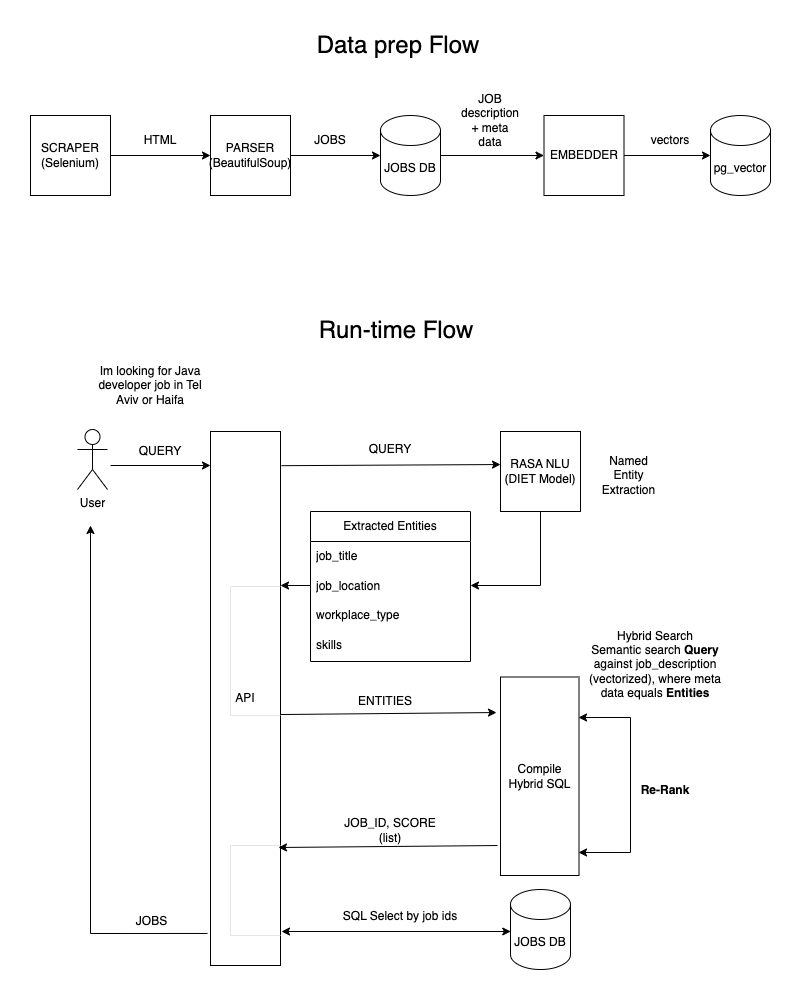

# Jobs AI Search

> AI-powered job search platform with real-time preference filtering.

## Project Overview

This proof-of-concept application helps users find relevant job listings through an intelligent search interface:

- The **Worker** scrapes job listings from LinkedIn using Selenium and BeautifulSoup
- Job descriptions and titles are embedded using transformers and stored in PostgreSQL with pg_vector
- The **NLU** component uses a RASA DIET model trained on thousands of annotated job listings to extract structured information from user queries
- The **API** leverages the NLU model to process search queries and builds hybrid search (semantic + keyword) to query the database
- The **Frontend** provides a real-time, interactive search experience with preference bubbles

## User Experience

Users can search for jobs by typing natural language queries into the search field. The system:

1. Dynamically extracts job preferences as the user types (skill bubbles, location, work type, etc.)
2. Updates search results in real-time based on these preferences
3. Presents semantically relevant job listings that match the user's requirements

## Preview


## Project Components

This mono-repo contains four main components:
- [API](/api/README.md): Backend FastAPI service for job search and NLU processing
- [Worker](/worker/README.md): Job scraper and data processor
- [Frontend](/frontend/README.md): Svelte-based user interface
- [NLU](/nlu/README.md): RASA-based natural language understanding service

## Technology Stack

- **Frontend**: Svelte
- **Backend API**: 
  - Python FastAPI
  - Pydantic for data validation
  - AsyncPG for fast database interactions
- **Worker**: 
  - Selenium, BeautifulSoup
  - Celery for task queue management
  - Transformers for text embedding
- **NLU**: RASA (DIET model)
- **Database**: PostgreSQL with pg_vector for semantic search

## System Architecture

<details>
<summary>Click to expand</summary>


</details>

## Quick Start

1. Clone the repository:
```sh
git clone https://github.com/amitpdev/jobs-ai-search.git
cd jobs-ai-search
```

2. Start infrastructure services using Docker:
```bash
# Run the infrastructure services
docker-compose up -d db redis selenium
```

3. Choose your preferred setup method for application components:
   - [Setup with Docker](#setup-with-docker) (recommended for quick start)
   - [Setup with Python Environment](#setup-with-python-environment) (recommended for development)

4. See individual component documentation for more details:
   - [API Documentation](/api/README.md)
   - [Worker Documentation](/worker/README.md)
   - [Frontend Documentation](/frontend/README.md)
   - [NLU Documentation](/nlu/README.md)

## Installation Options

### Pre-requisites

- Python 3.11 or higher (for Python environment setup)
- Docker and Docker Compose
- Node.js and npm (for frontend development)

### Setup with Docker

After starting the infrastructure services, you can run the application components with Docker as well:

```bash
# Build and run all application components
docker-compose up -d api worker frontend nlu beat
```

To shut down all services:
```bash
docker-compose down
```

### Setup with Python Environment (for development)

For detailed instructions on setting up Python environments for each component, refer to:
- [API Setup](/api/README.md)
- [Worker Setup](/worker/README.md)
- [NLU Setup](/nlu/README.md)

For the frontend development environment, see:
- [Frontend Setup](/frontend/README.md)

## License

This project is licensed under the MIT License - see the [LICENSE](LICENSE) file for details.

## Contact

**Amit Palomo**  
Email: [apalgm@gmail.com](mailto:apalgm@gmail.com)

If you have any questions or suggestions about this project, feel free to reach out!
